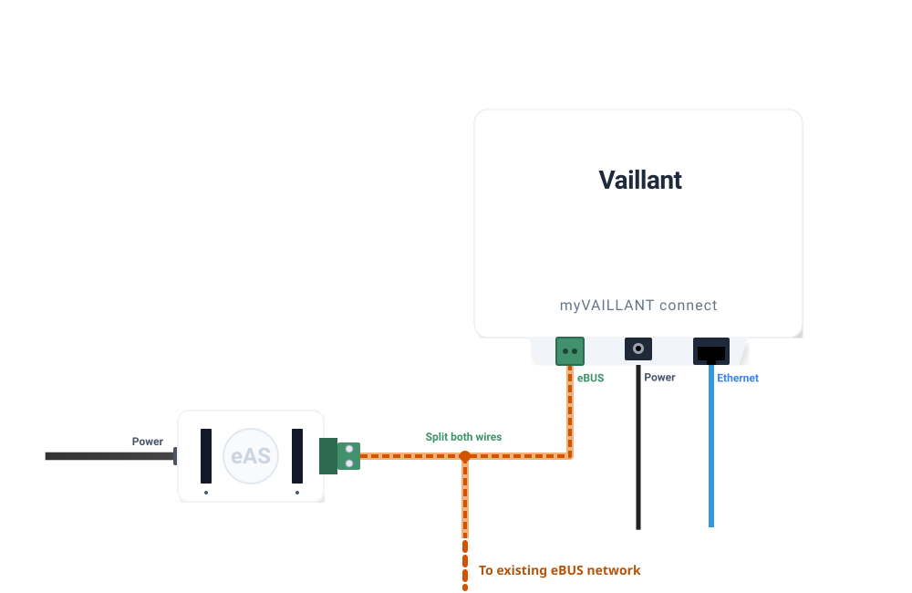

# ebusd Vaillant

Home Assistant custom component for Vaillant heating and hot water systems
controlled over [ebusd](https://github.com/john30/ebusd) via MQTT.

[Read the full documentation](https://signalkraft.com/ebusd-vaillant-component/).

## Features

- **Auto-discovery**  -  no manual entity configuration; entities appear as ebusd publishes topics
- **Heating zones (Z1-Z4)**  -  HVAC mode, temperature control, holiday schedules, quick veto (boost)
- **Hot water (HWC)**  -  operation mode, target/current temperature
- **Water pressure sensor**  -  live pressure reading in bar
- **Preset modes**  -  Boost (quick veto) and Away (holiday period)

## Requirements

- eBUS hardware adapter, such as the [C6 stick](https://adapter.ebusd.eu/v5-c6/stick.en.html)
- An [ebusd](https://github.com/john30/ebusd) instance publishing Vaillant messages to MQTT, see [ebus setup](https://signalkraft.com/ebusd-vaillant-component/ebusd/)
- Home Assistant with the [MQTT integration](https://www.home-assistant.io/integrations/mqtt/) configured

## Installation (HACS)

1. Go to **HACS → Integrations → Custom repositories**
   ([HACS custom repositories docs](https://hacs.xyz/docs/faq/custom_repositories/))
2. Add the repository URL: `https://github.com/signalkraft/ebusd-vaillant-component`
   with category **Integration**
3. Search for the `ebusd Vaillant` integration and **download** it
4. Restart Home Assistant
5. Add the integration through
   **Settings → Devices & services → Add integration
   → ebusd Vaillant**
   ([or click here](https://my.home-assistant.io/redirect/config_flow_start/?domain=ebusd_vaillant))
6. Configure the MQTT topic prefix (default: `ebusd`) and display name

## Installation (manual)

1. Download the latest `ebusd_vaillant.zip` from the
   [releases page](https://github.com/signalkraft/ebusd-vaillant-component/releases)
2. Unzip into your Home Assistant `custom_components` directory so the path
   becomes `custom_components/ebusd_vaillant/`
3. Restart Home Assistant
4. Add the integration through
   **Settings → Devices & services → Add integration
   → ebusd Vaillant**
   ([or click here](https://my.home-assistant.io/redirect/config_flow_start/?domain=ebusd_vaillant))
5. Configure the MQTT topic prefix (default: `ebusd`) and display name

> **Note:** Entities are discovered as ebusd publishes their topics. After adding the integration, it can take a few minutes for all entities to appear in Home Assistant.

## Configuration

| Setting | Default | Description |
|---|---|---|
| MQTT prefix | `ebusd` | Root topic ebusd publishes to |
| Name | `Vaillant` | Label prefix for entity names |

## Services

The integration exposes two diagnostic services:

- `ebusd_vaillant.dump_mqtt_values`  -  returns all accumulated MQTT values as YAML
- `ebusd_vaillant.record_topic_changes`  -  listens for `timeout` seconds and returns received topic values

## MQTT Mapping

See the [MQTT Mapping](https://signalkraft.github.io/ebusd-vaillant-component/mapping/) page for the complete reference of which topics map to which Home Assistant controls.
